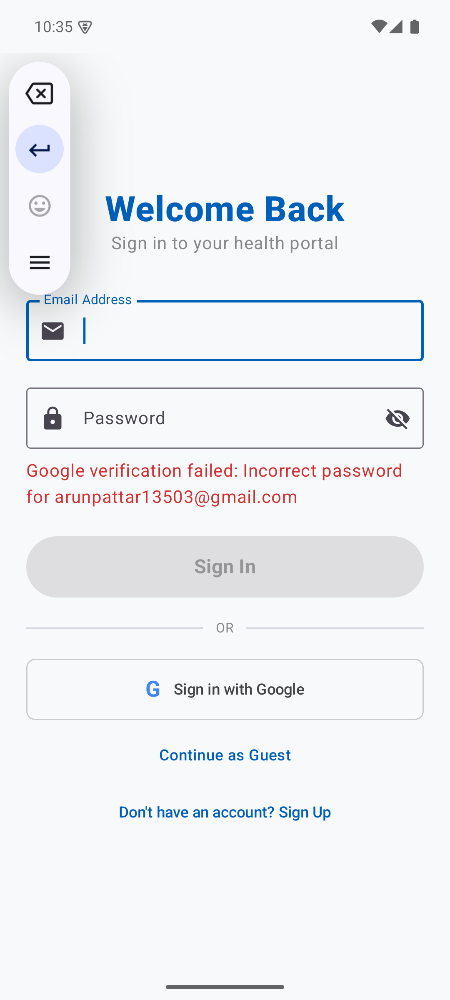
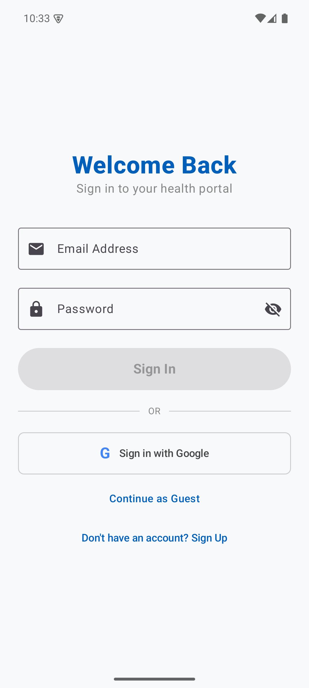
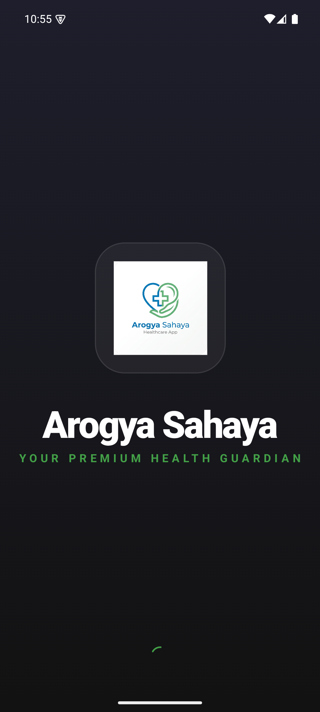
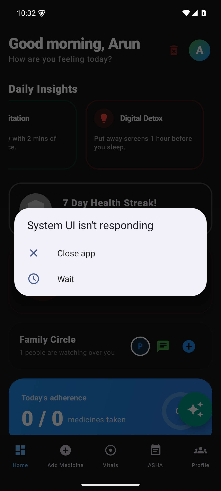

# 🌿 Arogya Sahaya (आरोग्य सहाय)

[](https://opensource.org/licenses/MIT)
[](https://kotlinlang.org/)
[](https://nodejs.org/)
[](https://www.prisma.io/)

**Arogya Sahaya** is a state-of-the-art, "Local-First, Cloud-Synced" health management ecosystem designed specifically to bridge the healthcare gap in rural and semi-urban areas. It empowers users to track their vitals, manage medications, and stay connected with community health (ASHA) workers, even in environments with intermittent connectivity.

---

## ✨ Key Features

- 📱 **Intelligent Vitals Tracking**: Log blood pressure, heart rate, and glucose levels with real-time trend analysis.
- 💊 **Medication Management**: Smart reminders and inventory tracking to ensure you never miss a dose.
- 🤝 **ASHA Connect**: Stay informed about local health camps, vaccination drives, and community health events.
- 🔄 **Cloud Sync (Local-First)**: Data is stored locally in Room DB and automatically synchronized to the cloud when online.
- 🌐 **Multilingual Support**: Fully localized in Hindi, Marathi, and Kannada to ensure accessibility for all.
- 📊 **Health Trends**: Visual data representation using MPAndroidChart to monitor health progress over time.

---

## 🏗️ System Architecture

The project follows a modern, distributed architecture ensuring high availability and data integrity.

### **Mobile Client (Android)**
- **UI Framework**: Jetpack Compose (Declarative UI)
- **Architecture**: MVVM (Model-View-ViewModel) + Repository Pattern
- **Local Persistence**: Room Database for offline-first capabilities
- **Networking**: Retrofit 2 with OkHttp for secure cloud communication
- **Concurrency**: Kotlin Coroutines & Flow for smooth, non-blocking operations

### **Backend Infrastructure (Cloud)**
- **Runtime**: Node.js & Express.js
- **ORM**: Prisma for type-safe database management
- **Database**: PostgreSQL (Hosted on Neon Cloud)
- **Security**: JWT Authentication, Bcrypt hashing, and TLS encryption
- **Deployment**: Optimized for Render.com CI/CD

---

## 📸 Screenshots

<div align="center">
  <table>
    <tr>
      <td><br/><b>Secure Entry</b></td>
      <td><br/><b>Dashboard</b></td>
      <td><br/><b>Health Trends</b></td>
    </tr>
    <tr>
      <td><br/><b>ASHA Connect</b></td>
      <td><br/><b>User Profile</b></td>
      <td><br/><b>Real-time Alerts</b></td>
    </tr>
  </table>
</div>

---

## 🛠️ Tech Stack & Tools

| Component | Technology |
| :--- | :--- |
| **Language** | Kotlin (Mobile), JavaScript (Backend) |
| **Database** | PostgreSQL, Room (Local) |
| **Networking** | Retrofit, Express API |
| **UI/UX** | Jetpack Compose, Material 3 |
| **Charts** | MPAndroidChart |
| **Animations** | Lottie Compose |

---

## 📂 Project Structure

```text
├── app/                  # Android Application Source
│   ├── src/main/java/    # Kotlin Source Code
│   └── build.gradle.kts  # App Dependencies
├── server/               # Node.js Backend Source
│   ├── src/              # API Routes & Controllers
│   ├── prisma/           # Database Schema & Migrations
│   └── package.json      # Backend Dependencies
├── docs/                 # Additional Documentation
└── README.md             # Project Overview
```

---

## 📜 License

Distributed under the MIT License. See `LICENSE` for more information.

---
*Developed with ❤️ by the Arogya Sahaya Team*
